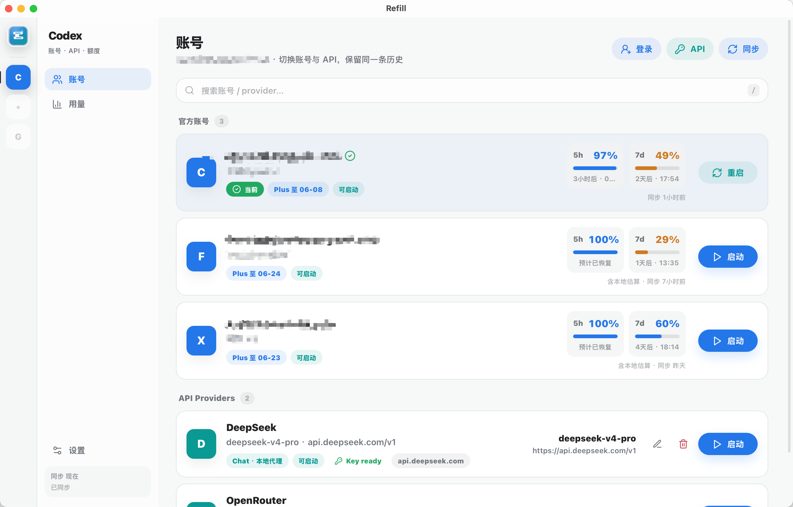

# Refill

**English** · [中文](README.zh-CN.md)

**Run many official Codex accounts as one — switch instantly, never lose your conversation history.**

Refill is a macOS app built around two things that normally break when you use
more than one Codex (ChatGPT) account:

1. **Multiple official accounts, first‑class.** Keep all your Codex logins side
   by side and switch between them in one click — no re‑login, no juggling
   `~/.codex`.
2. **One conversation history across all of them.** Your sessions, threads and
   projects are shared, so switching accounts never makes your history
   disappear — it's always there under whichever account is active.

On top of that it can also drive third‑party API providers (DeepSeek, OpenRouter,
…) and show your plan usage and API spend.

> Status: actively developed. Built with Tauri (Rust) + React.



### Core advantages
- 🔑 **Multi‑account, zero friction** — many official Codex accounts, one‑click switching.
- 🧵 **Unified, persistent history** — one shared conversation history that survives every switch.

---

### Why
- You juggle several Codex/ChatGPT accounts to get around weekly rate limits.
- You also want to use cheaper / different models (DeepSeek, OpenRouter, Kimi,
  local Ollama…) inside Codex.
- Switching normally means losing your conversation history and re‑logging in.

Refill makes switching instant and **keeps one history** no matter which account
or provider is active.

### Features
**The headline features:**
- **Multiple official Codex accounts** — keep all your ChatGPT/Codex logins and
  switch with one click. No re‑login, no manual `~/.codex` swapping; the active
  account is always clear at a glance.
- **History that survives every switch** — sessions, thread state and projects
  are shared across all accounts via a single store, so your conversation
  history is never lost or fragmented when you change accounts.

**Plus:**
- **Use Chat‑Completions‑only providers with Codex** — Codex only speaks the
  OpenAI *Responses API*. Refill runs a built‑in local proxy that translates to
  and from Chat Completions, so providers like **DeepSeek** work transparently —
  with **streaming, reasoning (thinking) and tool calls** supported.
- **Usage & cost**
  - *Official accounts*: per‑account weekly / 5‑hour quota windows, charted over
    time, so you can see exactly how much each period lets you consume.
  - *API providers*: real token usage with editable per‑model pricing → estimated
    cost, plus a request log.
- **Frictionless setup** — provider presets (DeepSeek / OpenRouter / Kimi /
  Ollama), a live connection test, and automatic protocol detection.
- **Safe by default** — API keys live in the macOS Keychain (never in config
  files), everything stays local, no telemetry.
- **Built to grow** — the tool rail is ready for more than Codex (Claude Code,
  Gemini CLI… are scaffolded).

### Requirements
- **macOS** — the release `.dmg` is a universal build (Apple Silicon **and** Intel).
- **Codex Desktop installed** — Refill switches accounts *for* Codex, so install
  the Codex app first.

### Install
1. Download the latest `.dmg` from [Releases](../../releases) and drag **Refill**
   to Applications.
2. The app isn't Apple‑notarized yet, so the first launch is blocked by
   Gatekeeper ("Apple could not verify…"). Allow it **once**, either:
   - **Terminal:** `xattr -dr com.apple.quarantine /Applications/Refill.app`, or
   - **System Settings → Privacy & Security →** after trying to open it once,
     click **Open Anyway**.
3. Keep Refill running while you use a Chat‑Completions provider (the local
   translation proxy lives inside the app).

> Want a frictionless, double‑click install? That needs Apple Developer ID
> signing + notarization — the pipeline is ready in `RELEASING.md` and just
> needs an Apple Developer account.

### Build from source
Requires Rust, Node 20+, and the Tauri prerequisites.
```bash
npm install
npm run tauri:build      # produces .app + .dmg under src-tauri/target/release/bundle
# or for development:
npm run tauri:dev
```

### How it works
- Each account/provider is a profile under `~/.codex-profiles/<id>`; `~/.codex`
  is symlinked to the active one.
- Sessions, the thread‑state SQLite DBs and project list are shared via a
  `_shared-history` folder, and the recorded provider is realigned on switch so
  history stays visible under whatever account is active.
- For Chat‑Completions‑only providers, the profile's `config.toml` points Codex
  at `127.0.0.1:8765`, where Refill's proxy translates Responses ⇄ Chat.

### Privacy
API keys are stored in the macOS Keychain. Conversation history, usage records
and logs stay on your machine under `~/.codex-profiles`. Refill sends nothing
anywhere except the API requests you make to your own providers.

## License
MIT
